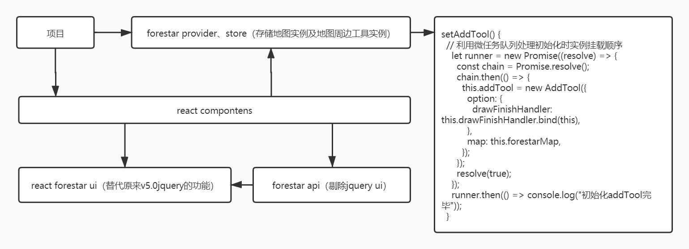

# 重构forestar@v5.0

### forestar api

- 去掉 `require` 语法
- 去掉 `jquery` 语法
- 使用 `ES6+`重构语法

### react forestar ui

- 替换原来`forestar@v5.0 api`中的`jquery ui`
- 只服务与`forestar api`

### react forestar provider

- 存储地图及地图工具的实例供项目使用

### example

#### 项目中使用 react components、forestar provider：

>	react 根节点注入 forestar provider，这样在其他页面才能拿到 forestar 实例们。

```tsx
import ReactDOM from "react-dom";
import { ForestarProvider } from "zelda-rc";

ReactDOM.render(
  <ConfigProvider locale={zhCN}>
    <ForestarProvider>
      <App />
    </ForestarProvider>
  </ConfigProvider>,
  document.getElementById("root")
);
```

> 获取 forestar 实例们。

```tsx
import React, { useContext } from "react";
import { Map, Compartment, ForestarContext } from "zelda-rc";

const Example: React.FC = () => {
  // 拿到地图实例和工具实例
  const context = useContext(ForestarContext);
  return (
    <div>
      <Map />
      <Compartment />
    </div>
  );
};
```

#### react components

> Map 组件

```tsx
import { ForestarContext } from "zelda-rc"

export const store = new Store({
	forestarMap: new ForestarMap(),
	distLocation: new DistLocation(),
	pointQuery: new PointQuery()
})
const Map: React.FC<IMap> = (props) => {
  ...
	const context = useContext(ForestarContext);
	// 地图初始化
  const init = () => {...};
  useEffect(() => {
		init();
		// 向forestar provider挂载实例
    context.setForestarMap(store.forestarMap);
    context.setDistLocation(store.distLocation);
    context.setPointQuery(store.pointQuery);
  }, []);
 	...
  return ...
};
export default Map
```

> Compartment 组件

```tsx
import { ForestarContext } from "zelda-rc"

const Compartment: FC<ICompartment> = (props) => {
	...
	const context = useContext(ForestarContext)
	...
	useEffect(() => {
		...
		context.setAddTool()
	}, [])
	...
	return ...
}
export default Compartment
```

#### forestar privider

```tsx
/**
 * 平台向业务层提供获取forestar api各个实例的store
 * **/
import React, { createContext } from "react";
...

export interface IStore {
  addTool?: any; // 区划工具条实例
  forestarMap?: IForestarMap;
  distLocation?: IDistLocation;
  pointQuery?: IPointQuery;
  setAddTool(): void;
  setForestarMap(value: IForestarMap): void;
  setDistLocation(value: IDistLocation): void;
  setPointQuery(value: IPointQuery): void;
}

class Store implements IStore {
  addTool?: any = undefined;
  forestarMap: IStore["forestarMap"] = undefined;
  distLocation: IStore["distLocation"] = undefined;
  pointQuery: IStore["pointQuery"] = undefined;
  // 挂载工具实例
  setAddTool() {
		// 利用微任务队列处理初始化时实例挂载顺序
    let runner = new Promise((resolve) => {
      const chain = Promise.resolve();
      chain.then(() => {
        this.addTool = new AddTool({
          option: {
            drawFinishHandler: this.drawFinishHandler.bind(this),
          },
          map: this.forestarMap,
        });
      });
      resolve(true);
    });
    runner.then(() => console.log("初始化addTool完毕"));
  }
  // 挂载地图实例
  setForestarMap(value: IForestarMap) {
    this.forestarMap = value;
  }
  // 挂载distLocation实例
  setDistLocation(value: IDistLocation) {
    this.distLocation = value;
  }
  // 挂载点查实例
  setPointQuery(value: IPointQuery) {
    this.pointQuery = value;
  }

  // 区划绘图完毕的回调
  private drawFinishHandler(params: {
    feature: Feature<Geometry>;
    area: any;
    toolType: string;
  }) {}
}

const store = new Store();
export const ForestarContext = createContext(store);
const Provider: React.FC = (props) => {
  return (
    <ForestarContext.Provider value={store}>
      {props.children}
    </ForestarContext.Provider>
  );
};
export default Provider;
```

> 流程图


